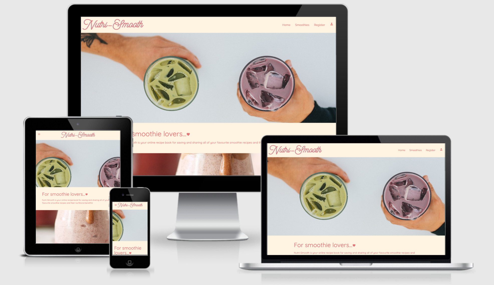

# Nutri-Smooth

[Visit site Nutri-Smooth](https://nutri-smooth.herokuapp.com/)

The aim of the Nutri-Smooth site is to encourage users to share a range of healthy, nutritious and tasty smoothie recipes. The site showcases a selection of smoothie recipe's, breaking down ingredients and macro-nutrients for each. 
Nutri-Smooth is a web application allowing users to create, read, update and delete their own smoothie recipes. It also allows users to search for recipes.
Nutri-Smooth has been created using a variety of languages including HTML, CSS and Python and uses MongoDB to store data.

# Contents
1. [UX](#UX)
2. [Wireframes and Mockups](#Wireframes-and-Mockups)
3. [Features](#Features)
4. [Technologies Used](#Technologies-used)
5. [Credits](#Credits)

Testing and Deployment can be found in a separate file:
[Testing & Deployment](https://github.com/RoxJade/nutri-smooth/blob/master/TESTING.md)

# UX

## User
Target Audeience/User Profile
- The site could be aimed at a wide range of ages, from 16 and above depending on the audience's interest in smoothies. 
- As the site will be designed to enable the user to store smoothie recipes as a digital recipe book, it's functionality is most likely to be utilised by people aged 28+.
- The audience is likely to lead a family lifestyle and maybe male or female with an interest in using mobile technology such as tablets and phones. They will appreciate the ability to store, save and revisit their digital recipe book. 
- They will have an invested interest in their health, food and nutrition and an active lifestyle.
- As the site will include a wide variety of smoothie types, including protein-based, some users may have an interest in an active lifestyle, sports or regularly attending the gym.

## User stories/User goals

1. As a user I want to be able to add and store my own smoothie recipes.
2. As a user I want to be able to read through my own smoothie recipes, share them with the community and read recipes added by others to gain inspiration and recreate them.
3. As a user I may wish to change a recipe or update it's ingredients.
4. As a user, I may wish to delete recipes I am no longer like.
5. As a user, I would like to be able to search for different smoothie recipes or ingredients for inspiration.
6. As a user, I want to be able to mark my favourite recipes and access these quickly.
7. As a user, I want the design of the site to be aesthetically appealing with clear navigation and a sense of calm and colour.
8. As a user I would like to know the breakdown of the nutrition or health benefits in the recipes so I can make informed, healthy choices.
9. As a returning user, I would like to access all of my added smoothies on my own personal profile.
10. As a user, I want the option to add minimal information to my smoothie recipes if I wish.
11. As a user, I want the option to add lots of information and imagery to my smoothie recipes if I wish.
12. As a simple recipe book, I would like the site to be easy and quick to navigate around. 
13. As a user, I want the site to be responsive, especially for mobile and tablet as I will probably be creating smoothie recipes from a mobile device in the kitchen.

## Scope
- The site will contain a page or individual pages listing all smoothies, these will be available for all site viewers.
- Users will be able to register their details and regularly return to their own profile, add their recipes and view their recipes. 
- Users will be able to add ingredients and nutritional information about the smoothies.
- Users will have the option to add images of their smoothies to go with their recipes.
- Users will be able amend and delete their added smoothie recipe information.
- Unless users are registered and signed in, they will not have the option to create, edit or delete smoothies.
- All users will be able to search for smoothies, via ingredients.
- Admin will be able to view all smoothies, delete all smoothies (if necessary), create and delete smoothie categories.
- Depending if time allows within development, there may be a feature to allow users to rate smoothies.

## Structure & Skeleton
**Data structure**

In MongoDB, I will create a 3 collections to capture and contain **user data, smoothie recipe data and smoothie category data**. Below is a an outline of how the data will be structured and where it links together. 
 
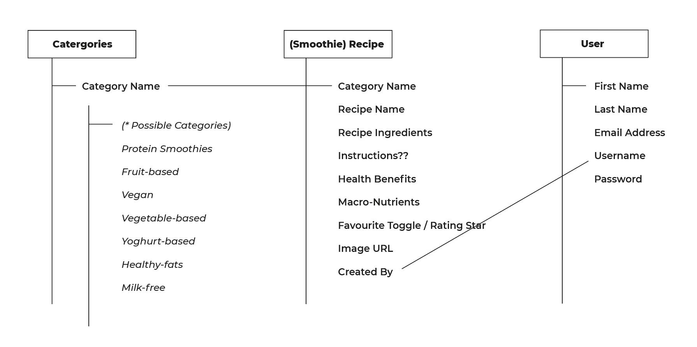
 

**Site structure**

Below is a basic structure of the main site navigation
 
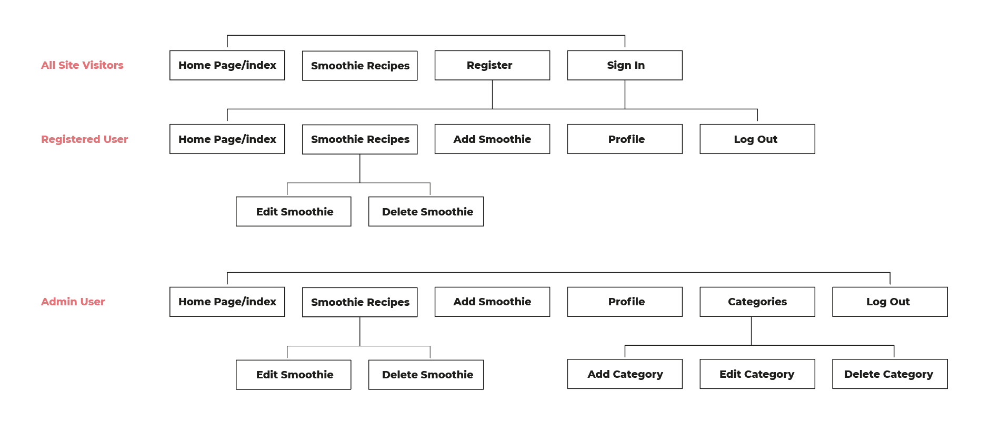
 

## Surface design

**Inspiration and Research**
I drew inspiration for the site from research on [pinterest](https://pinterest.com), [current website trends](https://99designs.co.uk/blog/trends/web-design-trends/) and [dribbble](https://dribbble.com/shots/6492236-Balosto?utm_source=Pinterest_Shot&utm_campaign=Podavalkin&utm_content=Balosto&utm_medium=Social_Share).
I was inspired by the impact of a 'parallax' feature and the 'comfortable colours' in the website trends article on 99 designs. 
**Colour Theme**
I developed a calm colour theme, inspired by a web-trend article and blended-smoothie colours. I decided to use colours mainly from the Materialize colour sets for ease of design and consistency throughout the site.
 
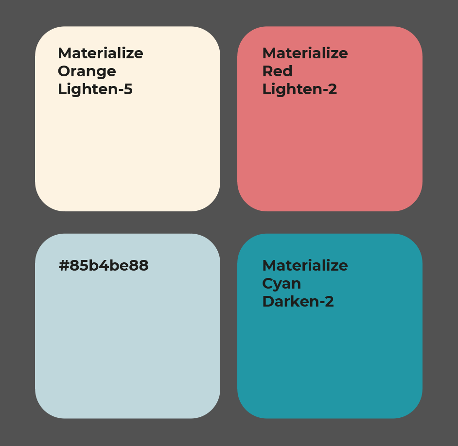
 

**Logo Development**
I initially designed a basic logo on Adobe Illustrator and saved as an SVG file (for great resolution and low file size). Further on down the line of developing the site, I decided to edit this to a more eye-catching design that tied in with my chosen fonts.
 
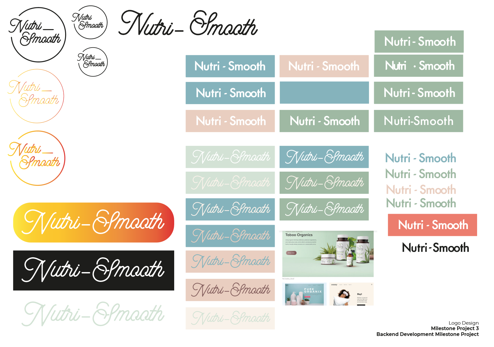
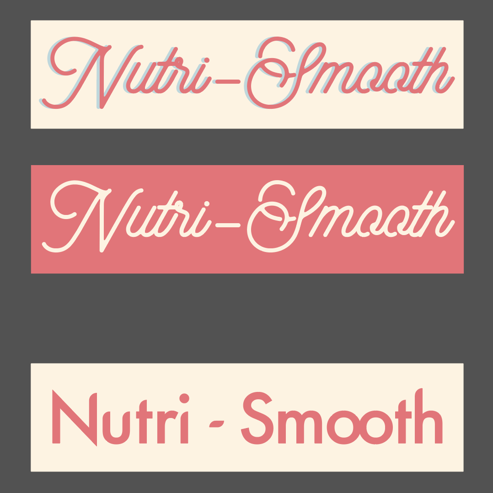
 

# Wireframes and Mockups
Below is a selection of wireframe designs for desktop, mobile and tablet. All pages primarily with forms will not be altered dramatically for different screen sizes unless necessary. The main pages that will display differently include the index page and the smoothie recipe page.
 
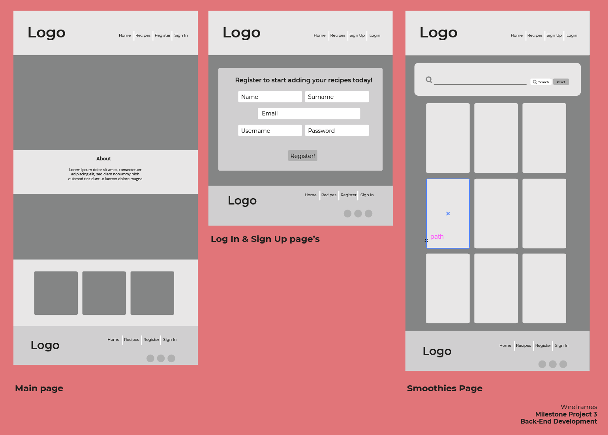
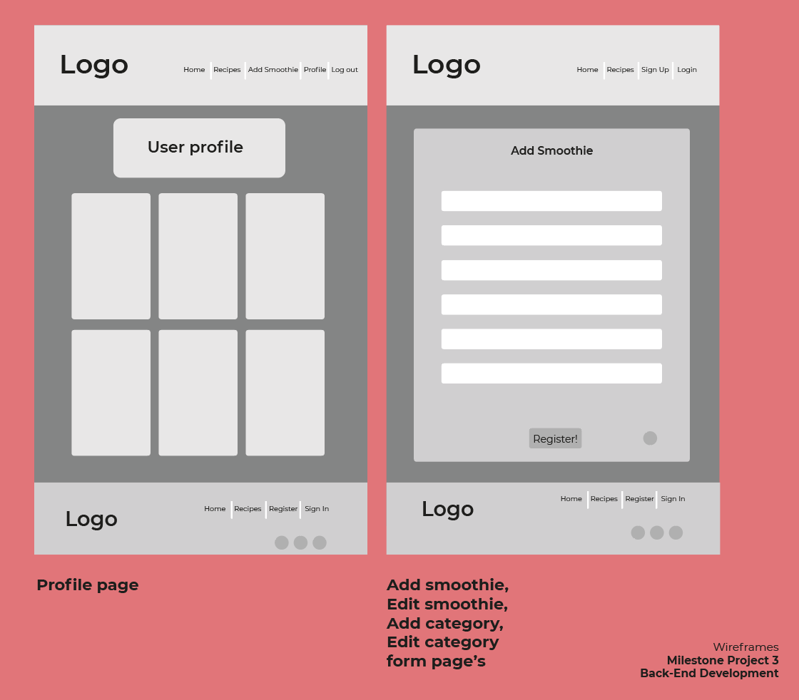
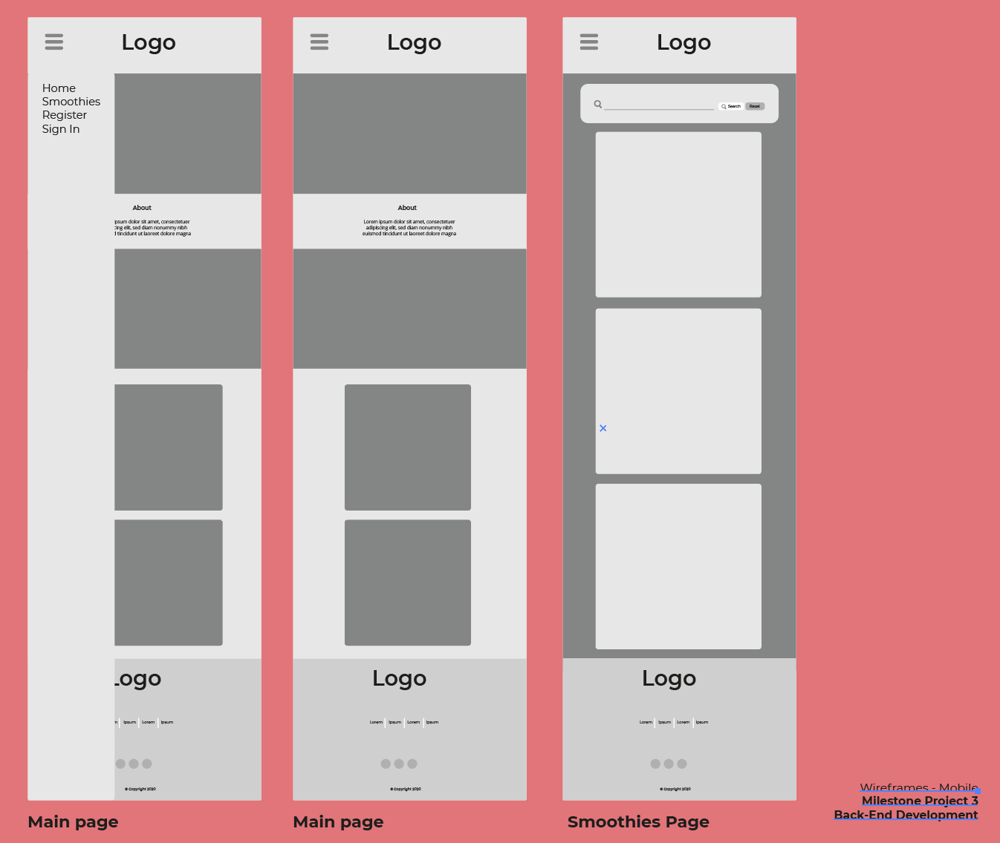
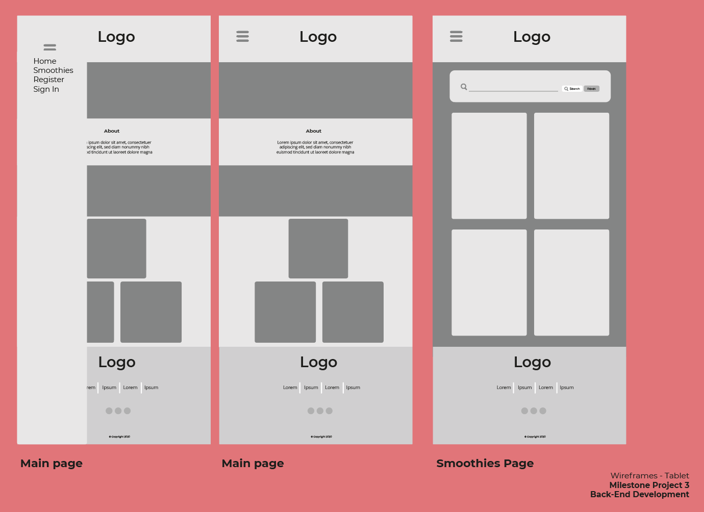

# Features

## Home/Index page
The main home page to grab the attention of the user and draw them in with about paragraph and links to register/sign up/see all smoothies.

- Navbar:
    - Navbar displays the Nutri-Smooth logo (which contains a home page link)
    - Links in navbar displayed to site visitor include: Home, Smoothies, Sign In and Register. 
    - Links in navbar displayed to registered/returning user include: Add Smoothie, Profile and Log Out.
    - Links in navbar displayed to admin user also include: Manage Categories.
    - Sign In is an icon, a tooltip will occur when hovered over 'Sign in?'
    - On mobile and tablet screens, the navbar converts a side nav and a 'hamburger' icon menu appears on the left side dropdown with the same links and centers the logo.

- Parallax feature:
    - Scrolls down over two images creating 3D movement illusion with an 'about' paragraph in the middle of container.

- 3 Card Features:
    - Three static image cards with, hover-over shadow effect, beneath the parallax with links in title's and paragraph's to take to user to Smoothies / Sign In / Register.

- Footer:
    - Footer displays the Nutri-Smooth logo (which contains a home page link).
    - Beneath logo an 'about' paragraph is displayed.
    - Links in footer displayed to site visitor include: Home, Smoothies, Sign In and Register. 
    - Links in footer displayed to registered/returning user include: Add Smoothie, Profile and Log Out.
    - Links in footer displayed to admin user also include: Manage Categories.
    - The footer contains 3 social icon links, that take you to the relevant site, targeting new pages.
    - A copyright logo and author name is also present.

 
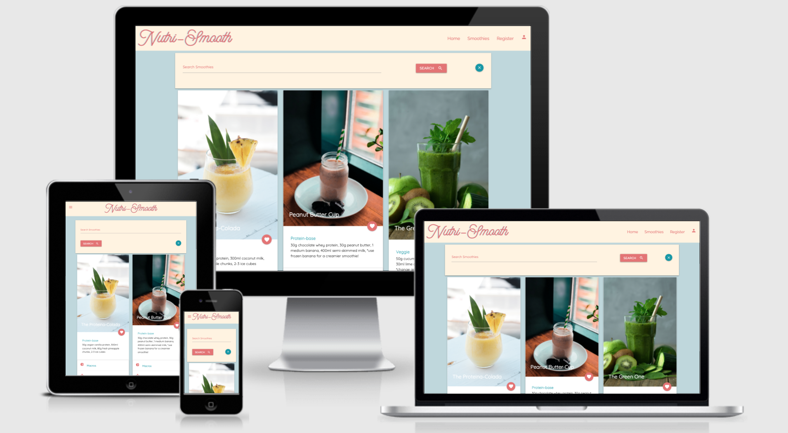

## Smoothies page
The smoothie recipe page to enable all visitors to see smoothie recipes added by community and a search-smoothie function.

- Search Bar:
    - Search bar can search for smoothie's based on name/category name/ingredients.
    - Has a 'submit search' button and a 'cancel' button to remove the current search and return user to all smoothies.

- Smoothie Cards:
    - Hover-over shadow effect for each card.
    - Card info displays: Image/alt message if user does not supply image, smoothie title, smoothie category, ingredients and user created by information.
    - Hover over heart icon causes tooltip indication of 'favourite' (if user has chosen to 'favourite' the recipe when adding).
    - Collapsible accordian expands to reveal macro information and health benefits on each card.
    - If user is signed-in, an edit and delete (plus/bin icons) appear with tooltip indicating 'Edit?'/'Delete' if the recipe belongs to that user (at bottom of card). On click, they take you to the relevant links.
    - Delete icon causes pop-up modal questioning deletion upon user click. Modal delete button deletes smoothie. Modal cancel icon returns user to 'smoothies' page.

 
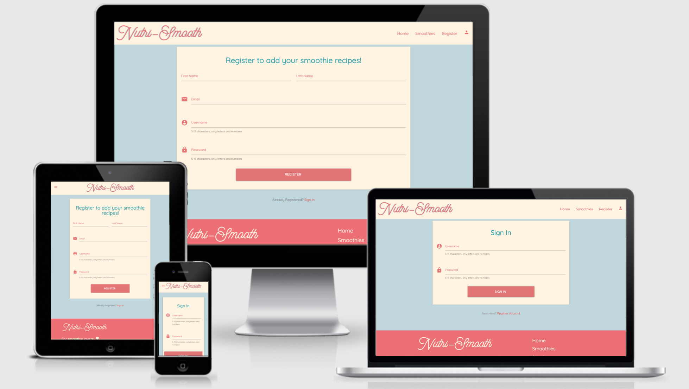

## Sign In / Register pages
The register and sign-in pages are similar, they both similar forms and request user information relevant to the user signing in or registering a new account.

- Register / Sign In forms:
    - Form fields with required information validate correct user entry - green indication/'great' helper text appears when user has added information within the set parameters. 
    - Form fields with required information validate incorrect user entry - red indication/'wrong' helper text appears when user has not met required parameters when entering information. 
    - Indication text for required parameters occurs on all input fields on both pages.
    - Register/Sign In buttons registers / sign's in user and returns a 'success' flash message success and redirects user to their profile.
    - Link beneath both forms to redirect user to 'sign in' / 'register' pages takes user to relevant links.

## User Profile page
User profile page is similar to 'Smoothies' page, it will show all recipe cards specifically added by that user, displayed using the same card layout as seen on the smoothie recipe page.

- Static welcome card displays at the top of the page with the username.
- Display all recipes cards exclusively added by that user **(except for admin user who can see all recipes)**.
- Collapsible accordian expands to reveal macro information and health benefits on each card.
- Displays the edit/delete (plus/bin icons) links on each card with tooltip indication. 
- Delete icon causes pop-up modal questioning deletion.
- Modal delete button deletes smoothie.
- Modal cancel icon returns user to 'smoothies' page.

 
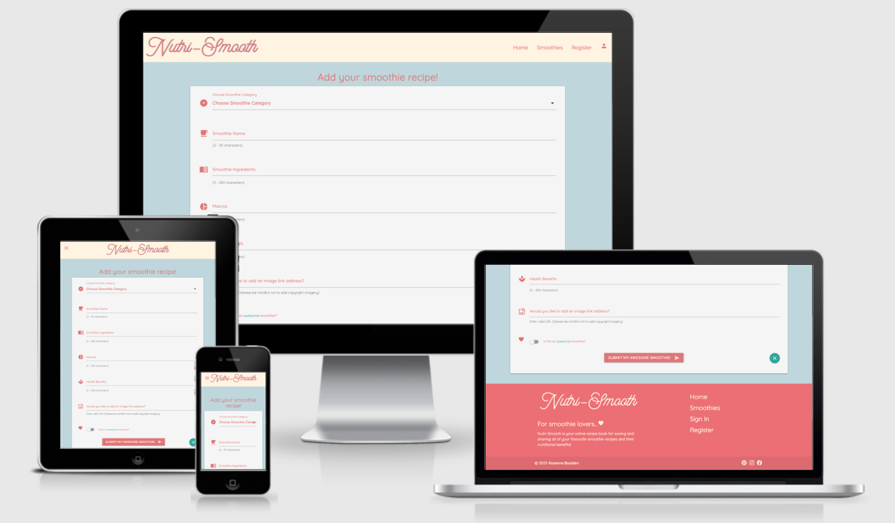

## Add Smoothie and Edit Smoothie pages
Add Smoothie and Edit Smoothie pages show the same form for the user to add/edit a smoothie. *Registered users can only edit their own smoothie recipes.

- Add Smoothie form:
    - Form fields validate correct user entry - green indication/'great' helper text appears when user has added information within the set parameters.
    - Form fields validate incorrect user entry - red indication/'wrong' helper text appears when user has not met required parameters when entering information.
    - Adding an image url on the form is not 'required' if user does not want to add one.
    - Indication text for required parameters occurs beneath each field.
    - Category dropdown selection reveals category selection.
    - Sumbit smoothie button saves new recipe and flashes 'success' message and returns user to smoothies page.
    - New smoothie is added it to user profile and smoothies page.
    - Cancel icon shows tooltip 'cancel' when hovered over and returns user to smoothies page.
- Edit Smoothie form:   
    - Form fields are pre-populated with data from the chosen smoothie for editing.
    - Form fields hvae green/red validation and parameter indications beneath where needed(same as 'add_smoothie' page).
    - Save changes button saves editing and flashes 'success' message and shows user new edit.
    - Cancel icon shows tooltip 'cancel edit?' when hovered over and returns user to smoothies page.

 
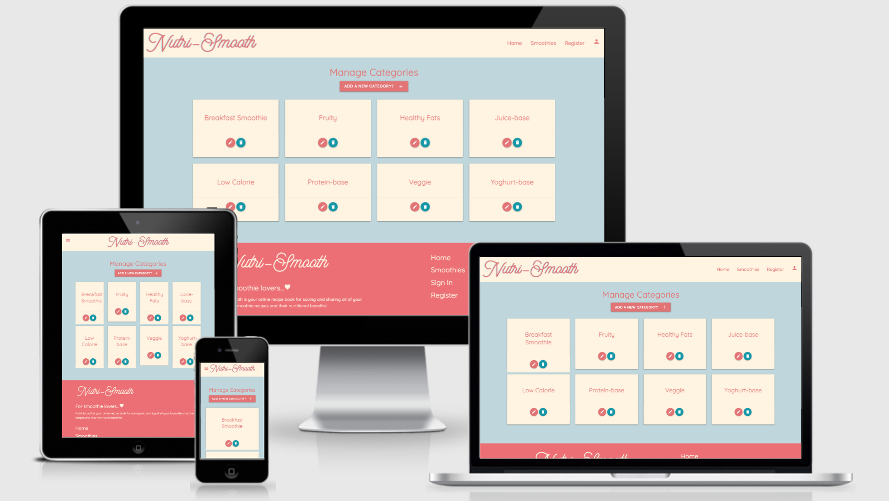

## Manage Categories page
The 'Manage Categories' link will appear exclusively for the signed-in admin user and allows the admin user to add, edit and delete smoothie categories. 

- Upon click, 'add new category' takes user to new 'add category' page.
- Displays category cards with category names and edit/delete icons with indicative tooltips.
- Delete icon causes pop-up modal questioning deletion.
- Modal delete button deletes category.
- Modal cancel icon returns user to 'manage categories' page.
- Edit category takes user to 'edit category' page.

 
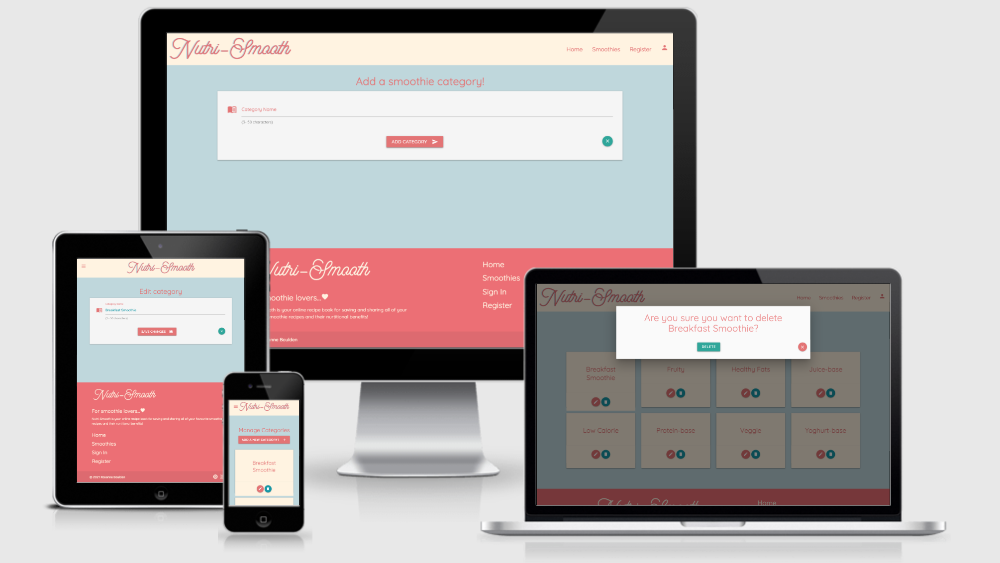

## Add and Edit Category pages
- Add category form:
    - Add smoothie category form displayed.
    - Add category button submits new category to 'manage categories' page and returns 'success' flash message.
    - Cancel icon with hover-over tooltip returns user to 'manage categories' page upon click.
- Edit category form:
    - Edit smoothie category form displayed.
    - Save changes button submits edited category to 'manage categories' page and returns 'success' flash message.
    - Cancel icon with hover-over tooltip returns user to 'manage categories' page upon click.

## Defensive programming 
- All delete buttons have a built in pop-up modal upon user click to question the users decision to delete.
- All forms with required information have the 'required' attribute, helper-text and green/red validation to guide the user.
- Sign In page detects incorrect username and/or password upon user sign in.

## Additional considerations and features to implement in the future

**To increase user experience:**
- Increase interactivity by adding a star rating / likes counter system for registered users to be able to rate smoothie recipes.
- Encourage more community engagement by requesting mini-smoothie reviews from users trying out shared smoothie recipes.
- Turn the admin user account into a 'superuser' by adding 'superuser' data to the database to allow more than one registered admin user to manage the site.
- Expand admin user privileges to enable deletetion of any added smoothie.
- Create a pop up modal or Materlialize 'feature discovery' giving clear instructions to the user on how to add image url's within the 'add smoothie' page, for users who may not know how to do this.

# Technologies Used

- [Gitpod and Github](https://github.com/RoxJade/) for version control.
- [Heroku](https://www.heroku.com/home) Site is deployed on Heroku platform.
- [MongoDB](https://www.mongodb.com/) Document oriented database used to all of my data collections.
- [Flask](https://flask.palletsprojects.com/en/1.1.x/) Flask web development framework.
- [Werkzeug](https://werkzeug.palletsprojects.com/en/1.0.x/) Used to add security to user passwords and debug code whlst in production.
- [Jinja Templating](https://jinja.palletsprojects.com/en/2.11.x/) Python templating language used.
- [Materialize](https://materializecss.com/) Frontend library used to style the site.
- [JQuery](https://jquery.com/) Javascript functionality to work with Materlialize.
- HTML.
- CSS.
- [Google fonts](https://fonts.google.com/) and [Google icons](https://fonts.google.com/icons). 
- [Adobe Illustrator](https://www.adobe.com/uk/products/illustrator.html) Used for the logo design and mockups.

# Credits
## Content
[Code Institute](https://learn.codeinstitute.net/courses/course-v1:CodeInstitute+DCP101+2017_T3/courseware/9e2f12f5584e48acb3c29e9b0d7cc4fe/054c3813e82e4195b5a4d8cd8a99ebaa/) - I used the Task-Manager mini-project tutorials to start and guide the project.
The design of the site was created by myself and influenced by Materialize.

## Additional resources and research
- Code Institute Mentor tutorials
- [Stack Overflow](https://stackoverflow.com/)
- [W3 Schools](https://www.w3schools.com/)
- [CDNJS](https://cdnjs.com/)
- [Slack](https://app.slack.com/)
- [CodeGrepper](https://www.codegrepper.com/code-examples/python/flask+url_for+external)
- [The NetNinja Materialize Tutorial series on You Tube](https://www.youtube.com/watch?v=gCZ3y6mQpW0&list=PL4cUxeGkcC9gGrbtvASEZSlFEYBnPkmff)
- [Codemy.com You Tube video - Using static files with flask](https://www.youtube.com/watch?v=O5m6lNy3w-g): Showed me how to insert images.

## Media
All images added are from Unsplash and are copyright free.
- [Unsplash](https://unsplash.com/)

## Acknowledgements
I received inspiration for ideas, colour palette and design of this project from: 
- [My Protein](https://www.myprotein.com/)
- [pinterest](https://pinterest.com)
- [current website trends](https://99designs.co.uk/blog/trends/web-design-trends/)
- [dribbble](https://dribbble.com/shots/6492236-Balosto?utm_source=Pinterest_Shot&utm_campaign=Podavalkin&utm_content=Balosto&utm_medium=Social_Share).
- [Nutritional Advice](https://www.nutritionadvance.com/healthy-foods/types-of-fruit/#tab-con-29)