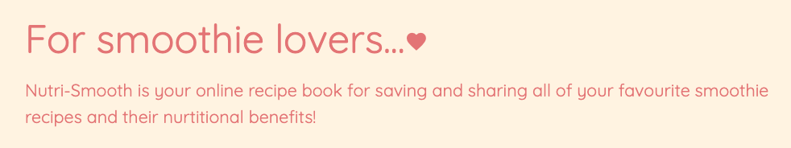

# Testing and Deployment

[Visit site here]()

# Contents

1. [Development and Problem Solving](#development-and-Problem-Solving)
2. [Testing for User Stories](#Testing-for-User-Stories)
3. [Responsiveness](#Responsiveness)
4. [Automated Testing](#Automated-Testing)
5. [Deployment](#Deployment)
6. [Browser Tests](#Browser-Tests)

# Development and Problem Solving

The first test I ran at the start of the project was to check the data I had entered when setting up MongoDB was being pulled across successfully from the Mongo database. 
I checked this using a Jinja for loop to iterate through the 'recipe' data. This was successful. 

After adding Materialize and the static CSS/Script files, I added a background template to style.css to test the files were connected. 
At this point Werkzeug pointed out a typo, I had not added a comma into the my script.js tag. Upon fixing this, the background colour worked. 

 

I found adding the logo image file to the navbar challenging. As I had not used Flask to add images before, I tried to add the image using the html method. 
After researching, I realised the correct method was to include the image in the static file and use the 'url_for' Flask method to integrate images ontot the site.
The following tutorials helped with this: [Codemy - How to Use CSS Javascript and Images With Flask Static Files](https://www.youtube.com/watch?v=w54WLGm4OrE) and [Tech with Tim - Static Files (Custom CSS, Images & Javascript)](https://www.youtube.com/watch?v=tXpFERibRaU).

 

After creating the registration form I tried to test the functionality I built on app.py, pulling the data through to MongoDB. 
Werkzeug pointed out a mistake I made with a typo and formatting of my python code. I needed to remove the '.html' on the 'register' variable so the 'insert_one()' method worked properly.
I then realised I also needed to format the code by removing some unecessary indentation. After I fixed these bugs, I entered the data into the registration form and checked MongoDB to find that it had all succesfully pulled through!

 

 

After completing the registration form, I duplicated it to create the Sign-in page. I removed all unecessary fields from the form, leaving the username and login. 
I add functionality for this page, including some defensive programming, checking for existing users and checking for incorrect username and/or password fields. 
I then tested all of the links for this, entered invalid user data and correct sign in data. All of these tests were successful.

 

During my mid-way tutorial session with mentor, he suggested looking into Python docstrings to replace the 'title' comments I had been making for a more professional outcome. 
I revisited the reading in the Coding Institute module regarding Docstrings and started adding these to my code. 

After building all of the user authentication, I moved onto developing cards and forms. Throughout the development of these, I constantly referred to the Chrome Dev Tools to 
experiment with different styles, colour palettes and fonts. It also helped me to find the correct element tags and classes to style in my CSS file.
On the 'add.smoothie.hmtl' form I ran some tests on the design and found, that although I had included min/max character lengths on the input fields, this wasn't very easy to navigate as a user.
So I added some 'helper-text' spans to aid the user experience with their data entry. 

 

I created the post functionality for the user to add their own recipes on the add_smoothies.html page and then tested this. This test revealed 3 bugs I needed to fix:
1. The image on the newly added recipe was a duplicate of the previous recipe image.
There was an easy solution to this that I had overlooked in early development. I realised I had left the original image in the code image source code on the get_recipes.html page (where I was using a placeholder image).
This caused the new image url to get blocked and MongoDB recieved it as null on the database. To correct this, I altered the image src to the correct jinja image request method. 
Then I changed the 'null' data on the Mongo database to the correct image url. Once refreshed, this worked fine. 

 

 

 

2. The layout of the page did not load how expected. The new card didn't conform to the columns. To solve this, I realised I needed to move the 'for loop' in recipes.html above the column class in the code to make sure the column was inside the loop.

3. The 'Materialize card tabs were not working properly.  When clicked on, the card tabs worked for one card but also activated on all other cards and the information appeared incorrectly.
To solve this, I decided to replace these with collapsible accordians to display the recipe macros and health benefits. 

## Issues in development

# Testing for User Stories

User Stories can be found in [The README.md UX](insert readme.md)

# Responsiveness

## Automated Testing

I used the code validators below and Lighthouse (Chrome Dev Tools):
- [Javascript - JS Hint](https://)
- [HTML W3 Validator](https://validator.w3.org/)
- [CSS W3 Validator](http://www.css-validator.org/)
- [PEP8 validator](http://pep8online.com/checkresult)

## PEP8 Online Python Validator:

After completing all python functionality for my site, I updated the docstrings and ran my code through the [PEP8 validator](http://pep8online.com/checkresult). This found no syntax errors.
 

## HTML Validator:

## CSS Validator:

## Javascript Validator:

## Lighthouse:

### Accessibility Issues: 
- "Background and foreground colours do not have a sufficient contrast ratio." 
Lighthouse suggested two of the main colours in my colour palette (Materilialize orange lighten-5 and red lighten-2) are too low in contrast. I decided not change this as I deliberately chose calm pastel tones relevant to the site design and to appeal to the audience.
 

# Deployment 

I started the project by creating a repository in GitHub and used the Gitpod IDE to write the code. I deployed the app to Heroku early on in the production of the app. I 
There were no issues or problems during the heroku deployment process. 
To deploy the Nutri-smooth web application, I used Heroku. Here is a step-by-step account of the process. 
1. I started by creating a requirements.txt to list all of apps and dependencies required to run the site. 
2. In the Gitpod terminal I used the command 'echo web: python app.py > Procfile' to create a Procfile for Heroku to to read the app.py file.
3. I logged into Heroku and created a new app, calling it 'nutri-smooth' to match the GitHub repository and the title/logo of the site.
4. I then chose automatic deployment from my GitHub repository, specifying the 'nutri-smooth' repo-name.
5. Once found, I connected it to my app. 
6. Before enabling the automatic deployment, I entered the configuration variables (hidden from Heroku inside the env.py file). This included the IP address, port, the secret key (generated using randomkeygenerator.com) a link to MongoDB and the 'nutri_smooth' database. 
7. Before deploying the site, I went back to Gitpod and committed the Procfile and requirements.txt.
8. Going back to Heroku, I enabled the automatic deployment and deploy branch. Heroku then built the app and successfully deployed it.

## Bugs discovered after deployment

## 1. 
## 2. 

# Browser Tests

After deployment, I tested the site on Safari, Firefox and Microsoft Edge...