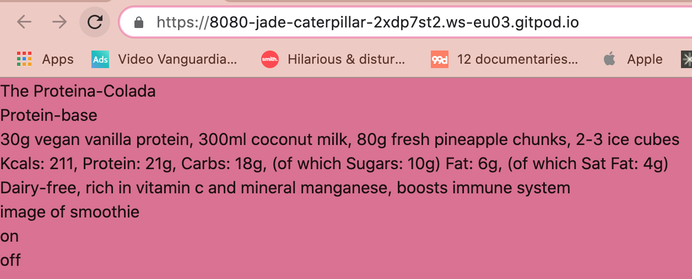
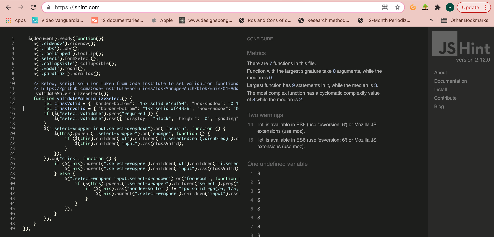
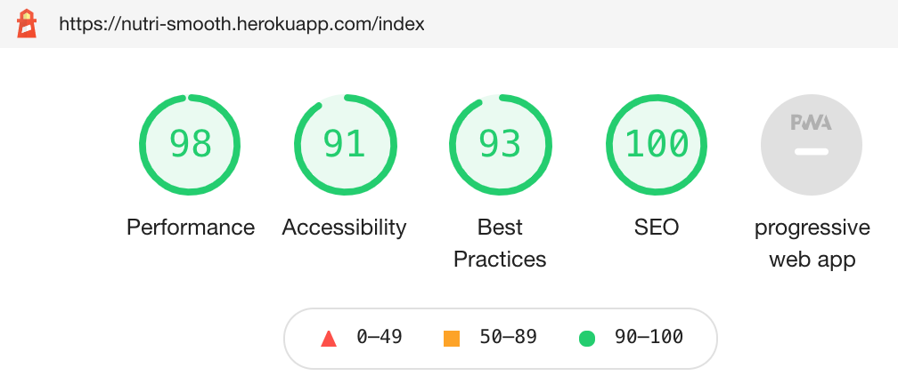

# Testing and Deployment

[Visit site Nutri-Smooth](http://nutri-smooth.herokuapp.com/index)

# Contents

1. [Deployment](#Deployment)
2. [Development and Problem Solving and Bugs](#development-and-Problem-Solving-and-Bugs)
3. [Testing for User Stories](#Testing-for-User-Stories)
4. [Responsive Testing](#Responsive-Testing)
5. [Automated Testing](#Automated-Testing)
6. [Browser Tests](#Browser-Tests)
7. [Manual Testing](#Manual-Testing)

# Deployment 

I started the project by creating a repository in GitHub and used the Gitpod IDE to write the code. I deployed the app to Heroku at the start of production.
To deploy the Nutri-smooth web application, I used Heroku. Here is a step-by-step account of the process:

Before the deployment process, I created a new collection on MongoDB with three sub-collections to store user data, smoothie recipe data and smoothie category data.

 

1. I started by creating a requirements.txt to list all apps and dependencies required to run the site. 
2. In the Gitpod terminal I used the command 'echo web: python app.py > Procfile' to create a Procfile for Heroku to to read the app.py file.
3. I logged into Heroku and created a new app, calling it 'nutri-smooth' to match the GitHub repository and the title/logo of the site.
4. I chose automatic deployment from my GitHub repository, specifying the 'nutri-smooth' repo-name.
5. Once found, I connected it to my app. 
6. Before enabling the automatic deployment, I entered the configuration variables (hidden from Heroku inside the env.py file). This included the IP address, port, the secret key (generated using randomkeygenerator.com) a link to MongoDB and the 'nutri_smooth' database. 
7. Before deploying the site, I went back to Gitpod and committed the Procfile and requirements.txt.
8. Going back to Heroku, I enabled the automatic deployment and deploy branch. Heroku then built the app and successfully deployed it.
There were no issues or problems during the heroku deployment process. 

# Development, Problem Solving and Bugs

A selection of some of the tests I ran, bugs and problem solving during development. 

**Test setup - MongoDB connection to Gitpod**
- The first test I ran at the start of the project was to check the data I had entered when setting up MongoDB was being pulled across successfully from the Mongo database. 
I checked this using a Jinja for loop to iterate through the 'recipe' data. This was successful. 

****
**Test setup - CSS/Script files working**

After adding Materialize and the static CSS/Script files, I added a background template to style.css to test the files were connected. 
At this point Werkzeug pointed out a typo, I had not added a comma into the my script.js tag. Upon fixing this, the background colour worked. 

****
**Problem-Solving - Adding images correctly using Flask**

I found adding the logo image file to the navbar challenging. As I had not used Flask to add images before, I tried to add the image using the html method. 
After researching, I realised the correct method was to include the image in the static file and use the 'url_for' Flask method to integrate images ontot the site.
The following tutorials helped with this: [Codemy - How to Use CSS Javascript and Images With Flask Static Files](https://www.youtube.com/watch?v=w54WLGm4OrE) and [Tech with Tim - Static Files (Custom CSS, Images & Javascript)](https://www.youtube.com/watch?v=tXpFERibRaU).

 

****
**Testing Bug - Registration page - syntax error**

After creating the registration form I tried to test the functionality I built on app.py, posting the data through to MongoDB. 
Werkzeug pointed out a mistake I made with a typo and formatting of my python code. I needed to remove the '.html' on the 'register' variable so the 'insert_one()' method worked properly.
I then realised I also needed to format the code by removing some unecessary indentation. After I fixed these bugs, I entered the data into the registration form and checked MongoDB to find that it had all succesfully pulled through!

****
**Testing - Defensive programming for invalid passwords**

After completing the registration form, I duplicated it to create the Sign-in page. I removed all unecessary fields from the form, leaving the username and login. 
I added functionality for this page, including some defensive programming, checking for existing users and checking for incorrect username and/or password fields. 
I then tested all of the links for this, entered invalid user data and correct sign in data. All of these tests were successful.

****
**Mentor Tutorial Advice - Change Python comments into Docstrings**

During my mid-way tutorial session with mentor, he suggested looking into Python docstrings to replace the 'title' comments I had been making for a more professional outcome. 
I revisited the reading in the Coding Institute module regarding Docstrings and started adding these to my code. 

****
**Problem Solving for Design and UX**

After building all of the user authentication, I moved onto developing cards and forms. Throughout the development of these, I constantly referred to the Chrome Dev Tools to 
experiment with different styles, colour palettes and fonts. It also helped me to find the correct element tags and classes to style in my CSS file.
On the 'add.smoothie.hmtl' form I ran some tests on the design and found, that although I had included min/max character lengths on the input fields, this wasn't very easy to navigate as a user.
So I added some 'helper-text' spans to aid the user experience with their data entry. 

****
**Testing Smoothie Recipe Cards - 4 bugs found**

I created the post functionality for the user to add their own recipes on the add_smoothies.html page and then tested this. Whilst the data was successfully being pulled from MongoDB, a few design bugs were evident. This test revealed 4 bugs I needed to fix:
1. The image on the newly added recipe was a duplicate of the previous recipe image.
There was an easy solution to this that I had overlooked in early development. I realised I had left the original image in the code image source code on the get_recipes.html page (where I was using a placeholder image).
This caused the new image url to get blocked and MongoDB recieved it as null on the database. To correct this, I altered the image src to the correct jinja image request method. 
Then I changed the 'null' data on the Mongo database to the correct image url. Once refreshed, this worked fine. 

2. The layout of the page did not load how expected. The new card didn't conform to the columns. To solve this, I realised I needed to move the 'for loop' in recipes.html above the column class in the code to make sure the column was inside the loop.

3. The 'Materialize card tabs were not working properly.  When clicked on, the card tabs worked for one card but also activated on all other cards and the information appeared incorrectly.
To solve this, I decided to replace these with collapsible accordians to display the recipe macros and health benefits. 

4. One common bug I wasn't successful in fixing was the recipe card movement. Because the recipe cards contained a collapsible this causes a gap between the cards when the collapsible is opened. I looked into how to fix this. I tried limiting the height of the image and the height of the card. These both worked but caused other layout problems. This is something I will look into fixing in the future. 
 

# Testing for User Stories
User Stories can be found in [The README.md UX](https://github.com/RoxJade/nutri-smooth/blob/master/README.md)

1. As a user I want to be able to add and store my own smoothie recipes.
    - When registered and signed in, users can see the option to add their recipes in the main navigation bar.
    - Forms on the 'add smoothie' page are self-explanatory with icons and helper text to guide the user.
    - Forms on the 'add smoothie' page have validation colour/messages to confirm the user's added information correctly.
    
2. As a user I want to be able to read through my own smoothie recipes, share them with the community and read recipes added by others to gain inspiration and recreate them.
    - In the main navbar, I can access the 'smoothies' page to read through all of the smoothies added by others, including my own.
    - In the main navbar, I can access my own profile to read through all smoothie recipes I've added.
    - Appealing images accompanying the smoothie recipes can be seen by the user for instant inspiration.

3. As a user I may wish to change a recipe or update it's ingredients.
    - When registered and signed in, users can see the option to edit their recipes at the bottom of their recipe cards.
    - Smoothie editing forms are self-explanatory with pre-populated fields to enable quick changes.

4. As a user, I may wish to delete recipes I no longer like.
    - When registered and signed in, users can see the option to delete their recipes at the bottom of their recipe cards.
    - Recipes will not be deleted immediately, in case a mistake is made. Pressing the delete icon will a trigger a delete modal, checking with the user if they definitely want to delete.

5. As a user, I would like to be able to search for different smoothie recipes or ingredients for inspiration.
    - A search bar can be easily found at the top of the 'smoothies' page.
    - Search bar is designed to return any word in the smoothie categories, smoothie name and smoothie ingredients to give the user a wide search function.

6. As a user, I want to be able to mark my favourite recipes and access these quickly.
    - On the 'add smoothie' page, there is an option to 'favourite' an added new smoothie recipe. (*Unfortunately, this is the only time a recipe can be 'liked/favourited' and would be a good feature to develop further in the future.)
 
7. As a user, I want the design of the site to be aesthetically appealing with clear navigation and a sense of calm and colour.
    - The site uses a colour palette reminiscent of 'blended smoothie', using colourful pastel's. The colour palette is limited to a small variety for a clearer user experience.
    - The site is easy to navigate around with clear links in the navbar, repeated at the top and bottom of all pages. Many pages contain signposted links to another relevant page including three links at the bottom of the index page on the 3 feature cards.

8. As a user I would like to know the breakdown of the nutrition or health benefits in the recipes so I can make informed, healthy choices.
    - User can add the nutritional values or health benefits to their smoothie recipe entries.
    - Users can find the nutritional and health benefits of the recipes on the smoothies page. There is a collapsible accordian, ready for the user to click on.
    - Users can access the search function, using keywords relating to the healthy ingredients they desire.
    - Helpful smoothie categories help to indicate possible health and nutritional benefits.

9. As a returning user, I would like to access all of my added smoothies on my own personal profile.
    - All smoothie recipes added by the user are saved on their personal account profile, ready for the users return.

10. As a user, I want the option to add minimal information to my smoothie recipes if I wish.
    - As shown in the helper text on the 'add smoothie' form, users do not need to enter sentences, in most cases, single words can be enough.

11. As a user, I want the option to add lots of information and imagery to my smoothie recipes if I wish.
    - On the add_smoothie page, users have the opportunity to add macro-nutrient information, health benefits and image links.
    
12. As a simple recipe book, I would like the site to be easy and quick to navigate around.
    - Flash messages appear upon submition of any edits/additions/deletions/signin/registration/searches throughout the site to reassure the user, their action was successful.
13. As a user, I want the site to be responsive, especially for mobile and tablet as I will probably be creating smoothie recipes from a mobile device in the kitchen.
    - Mobile side nav assists users with small screens.
    - Smoothie recipe cards show as scrollable coloumn on mobile screen and as pairs on slightly larger screens.

# Responsive Testing

As I developed the site, I used the Materialize grid system to maintain the site's responsiveness. Towards the end of development I reviewed this and included some additional media queries, mainly for mobile screens. 
At this point I ran tests on mobile, tablet, desktop and large screen displays. 

I ran into some screen issues with the search bar and found that I needed to repeat the 'search bar' code for mobile/tablet and desktop screens to allow the buttons to fall from the side of the search field, to beneath.
To see more responsive displays, see the [readme.md](https://github.com/RoxJade/nutri-smooth/blob/master/README.md).

# Automated Testing

I used the code validators below and Lighthouse (Chrome Dev Tools):
- [Javascript - JS Hint](https://jshint.com/)
- [HTML W3 Validator](https://validator.w3.org/)
- [CSS W3 Validator](http://www.css-validator.org/)
- [PEP8 validator](http://pep8online.com/checkresult)

## PEP8 Online Python Validator:

After completing all python functionality for my site, I updated the docstrings and ran all code from app.py through the [PEP8 validator](http://pep8online.com/checkresult). This found no errors.
 

## HTML Validator:
To validate the HTML, I used [HTML W3 Validator](https://validator.w3.org/).

**Every page had the same recurring warning:** "Section lacks heading. Consider using h2-h6 elements to add identifying headings to all sections." I have ignored this on every page check as I do require a header element on any of these sections.

- **index.html** (home page): No warnings or errors.
- **recipes.html** (smoothies page): 1 error - "Duplicate ID query, line 90." I am ignoring this as the id="query" is repeated because they are applicable for different screen sizes/media queries and will not get used simultaneously. I tested the search functionality to make sure this wouldn't be an issue and it was fine. 
- **profile.html** (user profile page): No warnings or errors.
- **add_smoothie.html** (add smoothie page): No warnings or errors.
- **edit_smoothie.html** (edit smoothie page): No warnings or errors.
- **categories.html** (manage categories page): No warnings or errors.
- **register.html** (registration page): No warnings or errors. 
- **signin.html** (user sign in page): No warnings or errors. 
- **add_category.html** (add category page): 1 error - "Bad value for attribute name on element button: Must not be empty, line 85." I removed this rogue empty name attribute from the add_category.html as it wasn't necessary.
- **edit_category.html** (edit category page): No warnings or errors. 

## CSS Validator:
To validate the CSS, I used [CSS W3](http://www.css-validator.org/). No errors were found.
 

## Javascript Validator:
To validate the JQuery code, I used [JS Hint](https://jshint.com/).
This picked up two warnings of the keyword use of 'Let'. I ignored these as this part of the JQuery code was taken from Code Institute.
 

## Lighthouse:
Below I have outlined a selection of issues suggested by Lighthouse:

### Accessibility: 
- "Background and foreground colours do not have a sufficient contrast ratio." 
Lighthouse suggested two of the main colours in my colour palette (Materilialize orange lighten-5 and red lighten-2) are too low in contrast. I decided not change this as I deliberately chose calm pastel tones relevant to the site design and to appeal to the audience.
 

- "Image elements do not have [alt] attributes."
Lighthouse picked up on images lacking 'alt' attributes. I then added these where necessary.

### Best Practices:
- "Links to cross-origin destinations are unsafe."
Lighthouse suggested the three social links in the footer are unsafe and rel="referrer" or rel="noopener" should be added to improve security. I added rel="referrer" attribute to each social link.

- "Document does not have a meta description."
Lighthouse suggested to include meta data about the site to improve SEO. I added these in the <head> of the base.html template.

Once I had addressed some of the suggestions from Lighthouse, I generated the Lighthouse report again, see before and after results:
 

**Before and After**

# Browser Tests

After deployment, I tested the site on Safari, Firefox and Microsoft Edge browsers and checked design and functionality.

- **Firefox:** No issues or errors, the site functions and displays appropriate in the Firefox browser.
- **Edge:** No issues or errors, the site functions and displays appropriate in the Microsoft Edge browser.
- **Safari:** No issues or errors, the site functions and displays appropriate in the Safari browser.

# Manual Testing

Below is a detailed review of the full functionality of the site and the manual tesing I carried out to check everything was working correctly. I tested all of the functionality accross mobile, tablet and desktop screens, checking for responsive design as well.

## Navbar & Footer
- **Logo links:** Upon click of logo, in navbar, side nav and footer, you should be taken to 'Home' page. Works as expected.
- **Navbar links & Mobile side nav links:** Home, Smoothies, Register, Sign In, Log Out, Add Smoothie, Manage Categories direct user to relevant pages. Works as expected.
- **Footer links:** Home, Smoothies, Register, Sign In, Log Out, Add Smoothie, Manage Categories direct user to relevant pages. Works as expected.
- **Footer social links:** Upon click, each social link (Pinterest/Facebook/Instagram) should open the relevant pages in new tabs. Works as expected.
## Index.html
- **Index parallax feature:** Scrolling down the page should create the illusion of images moving at a slower speed to the content of the foreground, creating an image reveal. Works as expected. *Although it should be noted that this effect looks better on a larger screen.
- **Index feature cards:** Shadow created upon hover over. Card title and text links take the user to the relevant pages. Both work as expected.
## Recipes.html (Smoothies)
- **Search bar:** 
    - Returns searches for any words in categories/recipe names/recipe ingredients. Works as expected.
    - Returns 'no results found' flash message if search cannot find words. Works as expected.
    - Search button executes search. Works as expected.
    - Cancel button removes search. Works as expected.
    - Search validation - turns red if less than 3 characters are entered and helper-text appears. Turns green when 3 or more characters are entered. Works as expected.
- **Smoothie recipe cards:**
    - Hover over shadow occurs for each card. Works as expected.
    - Card info displays: Image/alt message should appear, smoothie title, smoothie category, ingredients and user created by information. Works as expected **if user adds an image**
        - **Image Bug found**: Note, if user submits a new smoothie and chooses not to add an image link, this causes the card title to sit above the card and doesn't look good. In futuure, this is somthing I need to fix. 
        I'm limited for time now, but when I have the chance, possible solutions could be: To create an 'if condition' on the recipe page, if users do not include an image, it adds an alternative stockholder-smoothie image in it's place.**
    - Hover over heart icon causes tooltip indication of 'favourite' (if user has chosen to 'favourite' the recipe when adding).  Works as expected.
    - Collapsible accordian expands to reveal macro information and health benefits on each card. Works as expected, **however**, once expanded, it intrudes on the space below, causing a large gap between the next card, unless all cards on that row have been expanded.
    - Edit/delete (plus/bin icons) appear with tooltip indicating 'Edit?'/'Delete' if the recipe belongs to that user (at bottom of card). On click, they take you to the relevant links. Works as expected.
    - Delete icon causes pop-up modal questioning deletion. Works as expected.
    - Modal delete button deletes smoothie. Works as expected.
    - Modal cancel icon returns user to 'smoothies' page. Works as expected.
## Register.html
- **Form**
    - Form fields validate correct user entry - green indication/'great' helper text appears when user has added information within the set parameters. Works as expected.
    - Form fields validate incorrect user entry - red indication/'wrong' helper text appears when user has not met required parameters when entering information. Works as expected.
    - Indication text for required parameters occurs on username and password fields. Works as expected.
    - Register button registers new user and returns a flash message 'registration successful' and redirects user to their new profile. Works as expected.
    - Link beneath register form to 'sign in' page takes user to sign in page. Works as expected.
## Signin.html
- **Form**
    - Form fields validate correct user entry - green indication/'great' helper text appears when user has added information within the set parameters. Works as expected.
    - Form fields validate incorrect user entry - red indication/'wrong' helper text appears when user has not met required parameters when entering information. Works as expected.
    - Indication text for required parameters occurs on username and password fields. Works as expected.
    - Sign in button takes user to their profile and displays flash message 'welcome to nutri-smooth <username>'. Works as expected.
    - Logout displays flash message 'successfully logged out' and returns user to sign in page. Works as expected.
    - Link beneath sign in form to 'register' page takes user to register page. Works as expected.
## Profile.html
- **User card and recipe cards**
    - Display all user name card. Works as expected.
    - Display all recipes cards exclusively added by that user (except for admin user who can see all recipes). Works as expected.
    - Displays the edit/delete (plus/bin icons) links on each card with tooltip indication. Works as expected.
    - Delete icon causes pop-up modal questioning deletion. Works as expected.
    - Modal delete button deletes smoothie. Works as expected.
    - Modal cancel icon returns user to 'smoothies' page. Works as expected.
## Add_smoothie.html
- **Form**
    - Form fields validate correct user entry - green indication/'great' helper text appears when user has added information within the set parameters. Works as expected.
    - Form fields validate incorrect user entry - red indication/'wrong' helper text appears when user has not met required parameters when entering information. Works as expected.
    - Adding an image url on the form is not 'required' if user does not want to add one.
    - Indication text for required parameters occurs beneath each field. Works as expected.
    - Category dropdown selection reveals category selection. Works as expected.
    - Switch toggle changes colour upon click. Works as expected.
    - Sumbit smoothie button saves new recipe and flashes message 'your smoothie has been added' and returns user to smoothies page. Works as expected.
    - New smoothie is added it to user profile and smoothies page. Works as expected.
    - Cancel icon shows tooltip 'cancel' when hovered over and returns user to smoothies page. Works as expected.
## Edit_smoothie.html
- **Form**
    - Form fields are pre-populated with data from the chosen smoothie for editing. Works as expected.
    - Form fields hvae green/red validation and parameter indications beneath where needed(same as 'add_smoothie' page). Works as expected.
    - Save changes button saves editing and flashes message 'your smoothie has been updated' and shows user to the newly edited form. Works as expected.
    - Cancel icon shows tooltip 'cancel edit?' when hovered over and returns user to smoothies page. Works as expected.
## Categories.html
- **Category Cards**
    - 'Manage Categories' link can only be seen/accessed when logged in by 'admin' user. Works as expected.
    - Upon click, 'add new category' takes user to 'add_category.html'. Works as expected.
    - Displays category cards with category names and edit/delete icons with indicative tooltips. Works as expected.
    - Delete icon causes pop-up modal questioning deletion. Works as expected.
    - Modal delete button deletes category. Works as expected.
    - Modal cancel icon returns user to 'manage categories' page. Works as expected.
    - Edit category takes user to 'edit_category' page. Works as expected.
## Add_category.html
- **Form**
    - Add smoothie category form displayed. Works as expected.
    - Add category button submits new category to 'categories.html' and returns user there with flash message 'category successfully added'. Works as expected.
    - Cancel icon with hover-over tooltip returns user to 'categories.html' upon click. Works as expected.
## Edit_category.html
- **Form**
    - Edit smoothie category form displayed. Works as expected.
    - Save changes button submits edited category to 'categories.html' and returns user there with flash message 'your edit has been saved'. Works as expected.
    - Cancel icon with hover-over tooltip returns user to 'categories.html' upon click. Works as expected.